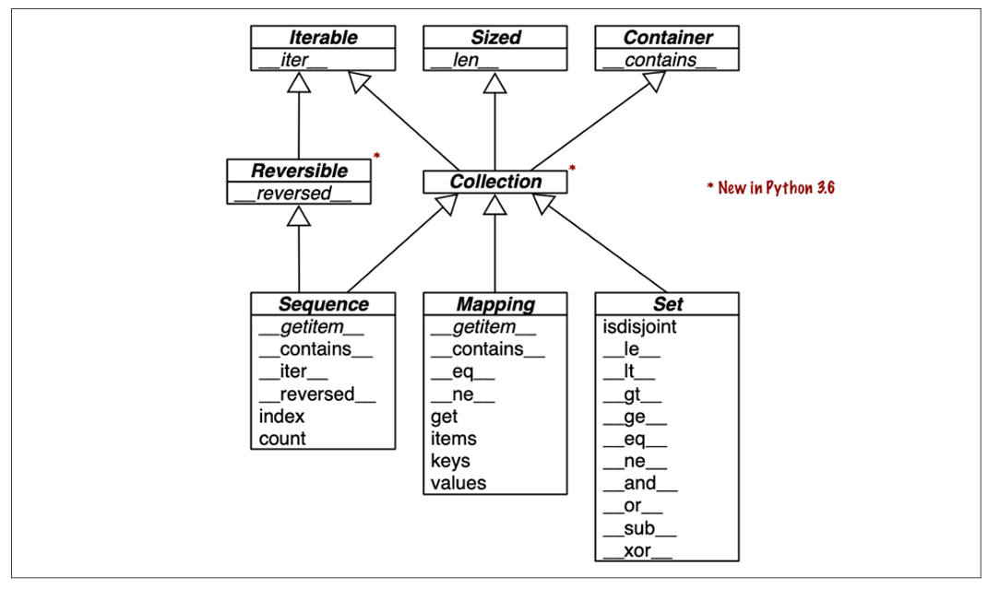

# 1. Data Structure

## 1 - 1. The Python Data Model

- Python Data Model: 객체가 언어 기능들과 잘 조화되도록 해주는 API
    - 파이썬 인터프리터가 객체가 특정 동작을 하게 하도록 호출하는 특별한 메소드들이 존재
    - 이런 메소드들은 보통 double-underscore로 감싸져 있으며, 이런 메소드를 직접 구현해서 객체가 특정 동작을 지원하거나 특정 객체와 상호작용하도록 지원할 수 있음.
    - '파이썬 객체가 어떻게 동작할지를 정의하는 내부 프로토콜의 집합'

- 아래와 같은 목록을 지원하거나 상호작용하도록 할 수 있음.
    - Collections: 컬렉션 (집합형 객체)
        - 예: list, dict, set, tuple처럼 여러 값을 담는 객체들
        - 사용자가 직접 만든 클래스도 `__len__`, `__getitem__`, `__contains__` 같은 메서드를 구현하면 컬렉션처럼 동작할 수 있음.
    - Attribute access: 속성 접근
        - 예: obj.name 처럼 객체의 속성에 접근할 때
        - 내부적으로는 `__getattr__`, `__getattribute__`, `__setattr__` 같은 special method가 호출됨
    - Iteration (including asynchronous iteration using async for): 반복 (비동기 반복 포함)
        - 일반 반복: `for x in obj` → `__iter__()` or `__getitem__()`
        - 비동기 반복: async for x in obj → `__aiter__()` & `__anext__()`
        - 비동기 환경에서도 반복문을 쓸 수 있게 해주는 프로토콜
            - 비동기: async.md, coroutine_event_loop.md 참고
    - Operator overloading: 연산자 오버로딩
        - 오버라이드 vs 오버로딩: overloading.md 참고
        - 예: +, ==, <, * 같은 연산자
        - 객체에 따라 다르게 동작하도록 하려면 `__add__`, `__eq__`, `__lt__`, `__mul__` 등을 오버라이드
    - Function and method invocation: 함수나 메서드를 호출하는 행위
        - 객체가 함수처럼 호출될 수 있게 하려면 `__call__()` 메서드 정의
    - String representation and formatting: 문자열 표현 및 포맷팅 => 객체를 출력하거나 포맷할 때 어떤 문자열로 보여줄지 결정하는 메서드들
        - str(obj): `__str__()`
        - repr(obj): `__repr__()`
        - format(obj, ".2f"): `__format__()`
    - Asynchronous programming using await: await를 사용하는 비동기 프로그래밍
        - `await some_coroutine()` : 내부적으로는 `__await__()` 메서드 사용
        - 이건 Coroutine 객체가 기다릴 수 있는 객체가 되도록 만드는 방식
    - Object creation and destruction: 객체의 생성과 삭제
        - 생성 시: `__new__()` → `__init__()`
        - 소멸 시: `__del__()` => 메모리 할당과 해제를 컨트롤할 수 있음
    - Managed contexts using the with or async with statements: with 또는 async with 문을 사용하는 컨텍스트 관리
        - `with open("file.txt") as f:` `__enter__()` & `__exit__()`
    - async with resource: 자원(파일, DB, 락 등)을 안전하게 열고 닫기 위한 구조
        - `__aenter__()` & `__aexit__()`


- 주의 경고: 'Any use of `__*__` names, in any context, that does not follow explicitly documented use, is subject to breakage without warning.'
    - 즉, 매직 메소드 문법을 니맘대로 써도 우리는 그거 나중에도 잘 동작할지 보장 못해준다~ 는 파이썬 공식 문서의 경고

##### example 1 - 1

- Pythonic Card Deck
    - 코드 파일 참고
    - special method를 통해 Python Data Model을 잘 쓰면 생기는 이점
        - 유저가 매 객체마다 흔한 operatrion을 쓰려고 각각 다른 메소드 이름을 기억할 필요가 없음.
        - random.choice 처럼 이미 있는 파이썬 라이브러리를 잘 가져다 쓰는 것이 구현이 더 쉽다.
        - `__getitem__`에 의해 인덱싱 뿐 아니라 슬라이싱도 지원이 가능하다.
        - 파이썬에서 `for x in obj` 코드 내부 동작 => `__getitem__`이 구현되어 있다면 for문도 자연히 가능 => 아래와 같은 이유
            - iter(obj) 호출 → 내부적으로 `obj.__iter__()` 호출 시도
            - 만약 `__iter__()`가 없다면 fallback으로 → `__getitem__()` 시도함.
            - `obj[0]`, `obj[1]`, `obj[2]` ... 순차적으로 호출함.
            - IndexError가 나면 반복이 종료됨. => 따라서 getitem 메소드만 구현했는데, IndexError를 넣어주지 않으면 무한 루프가 실행됨.

- 파이썬이 getitem 메소드만으로도 for문을 지원하는 이유
    - list, tuple 같은 객체는 처음부터 `__getitem__()`만 있었음
    - 그래서 반복 가능 객체의 기준 = `__getitem__()`이 있는 객체였다고 함.
    - 나중에 `__iter__()`가 추가되면서, 더 명확하고 유연하게 반복자를 정의할 수 있게 됨
    - 하지만 여전히 Python은 `__getitem__()`만 있어도 "반복 가능 객체"로 인정함.

- 그러면 `__iter__()`를 왜 사용하나
    - 반복 로직을 더 자유롭게 커스터마이징하고 싶을 때
    - 무한 반복, 중단 조건 등 복잡한 로직을 넣고 싶을 때
    - 이터레이터 프로토콜을 명시적으로 따르고 싶을 때
    - in, list(), sum() 등과의 호환성을 높이기 위해

- 그럼 enumerate, reversed는?
    - enumerate
        - 내부적으로는 `iter(obj)`를 호출해서 반복 가능한 이터레이터 객체를 얻고, 그걸 감싸서 `(index, value)` 튜플을 내주는 객체를 리턴함
        - 내부적으로 결국 for문을 돌기 때문에, getitem 매직 메소드만으로 잘 동작함
    - reversed
        - 만약 `__reversed__()`가 있으면 그를 가장 먼저 호출함.
        - 없다면 len + getitem 조합을 찾아서 for문을 직접 수행
        - 따라서 카드덱 예시에서는 잘 작동함

- obejct 객체: 파이썬의 모든 값, 함수, 클래스, type 등의 메타클래스는 객체, 이들은 모두 object를 직, 간접적으로 상속받음
    - str, repr, eq, hash(객체를 해시로 변환), init, class 등의 메소드가 지원됨, 클래스를 만들고 아무것도 구현하지 않아도 이런 것들이 가능함.
    - `print(dir(object))` 코드로 모든 attribute, method 확인 가능
        - `['__class__', '__delattr__', '__dir__', '__doc__', '__eq__', '__format__', '__ge__', '__getattribute__', '__getstate__', '__gt__', '__hash__', '__init__', '__init_subclass__', '__le__', '__lt__', '__ne__', '__new__', '__reduce__', '__reduce_ex__', '__repr__', '__setattr__', '__sizeof__', '__str__', '__subclasshook__']`
        - python 3에서는 object 상속을 명시 하나 안하나 같지만, 2에서는 차이가 컷음. => 호환성을 위해 명시적으로 상속하는 코드들이 아직 존재한다고 함.

- 예제 마무리
    - Example 1 - 1 의 FrenchDeck은 명시하지 않아도 기본적으로 object를 상속받지만, 그 기능 대부분은 상속이 아니라, Python 데이터 모델과 '조합(composition)'을 잘 활용한 결과
    - `__len__`과 `__getitem__`이라는 특수 메서드를 구현함으로써, FrenchDeck은 마치 표준 파이썬 시퀀스(list 등)처럼 행동함.
        - 그 결과로 파이썬 언어의 핵심 기능들(예: 반복, 슬라이싱)을 자유롭게 쓸 수 있게 되었음.
        - random.choice, reversed, sorted 같은 표준 라이브러리 함수들도 문제없이 사용할 수 있었음.
    - 이게 가능한 이유는, 우리가 클래스 안에 list를 직접 상속하지 않고 조합(composition)을 사용했기 때문.
        - 즉 attribute로 list를 갖게 만들어서 모든 작업(`__len__`, `__getitem__`)을 내부의 self._cards 리스트에 위임(delegate)했기 때문
    - 이는 파이썬 객체 철학의 핵심 중 하나, 상속보다 조합이 유연하고 안전하다는 객체지향 설계 원칙

- 지금까지 만든 FrenchDeck은 셔플(shuffle)이 불가능
    - 불변(immutable)하기 때문, 카드 리스트인 `_cards`를 직접 건드리지 않으면 위치 변경이 불가능
    - 하지만 직접 `_cards`를 바꾸는 건 캡슐화를 깨는 행위 => 직접 `_cards`를 바꾸는 건 안 좋은 방식
    - 현재 상태는 안전하지만 변경 불가능(immutable) => shuffle 같은 mutable 동작이 필요한 경우, 더 확장해야 함
    - 이후 딱 한 줄짜리 `__setitem__`을 구현함으로써, FrenchDeck을 mutable한 시퀀스처럼 만들어서 셔플 기능도 가능하게 할거라 함.


##### How Special Methods Are Used

- 가장 먼저, 매직 메소드는 코드에서 직접 호출하기 위해 만들어진 게 아니다.
    - `len(my_list)`가 맞지, `my_list.__len__()`는 아니다.
    - 파이썬 인터프리터에 의해 호출되기 위해 작성되었음.
    - user-defined class라면 파이썬이 직접 호출해줄 것.

- 파이썬 인터프리터는 list, str, bytearray 같은 내장 타입이나 NumPy 배열 같은 확장 타입을 처리할 때는 특별한 빠른 처리를 지원함.
    - C로 작성된 파이썬의 가변 크기 컬렉션(예: list, str 등)은 PyVarObject라는 구조체(struct)를 기반으로 만들어짐.
    - 이 구조체에는 ob_size라는 정수형 필드가 있어서 컬렉션 안의 아이템 개수를 저장함.
    - 만약 내장 타입 중 하나라면, len(my_object)는 ob_size라는 필드 값을 직접 가져오기만 하면 되기 때문에 메서드를 호출보다 가져오는게 더 빠름.
    - 즉, `len()` 이 `__len__()` 호출이 아니라 내부 필드로 이어지는 경우도 있음.

- 유저는 코드에서 직접 매직 메소드를 호출할 일이 없는 것이 좋다.
    - 유일한 예외는 `__init__` 안에서 super 클래스의 init을 호출하는 경우이다.
    - 만약 그럴 일이 발생한다면, built-in 함수들을 사용한다.
        - ex: len, iter, str 등
    - built-in 함수들은 직접적인 호출과 같은 기능 뿐 아니라 built-int type 들에 대한 더욱 최적화된 기능을 제공함.


##### Emulating Numeric Type

- 몇몇 매직 메소드를 통해서 덧셈과 같은 operator에 user object가 반응하도록 할 수 있음.
    - 이를 실습하기 위해 n-dimensional euclidean vector를 표현하는 클래스를 구현하는 실습을 진행.

- 목표는 아래와 같음 => 책에서는 이를 API를 디자인한다고 표현함.
    - 유클리드 벡터의 덧셈을 `+` 연산자로 수행하도록 구현
    - abs 메소드에 반응하여 벡터의 크기를 리턴하도록 한다.
    - `*` 연산자를 통해 scala multiplication을 수행하도록 한다.

- 이를 `example_1_2.py` 에서 실습함.
    - 위에서 묘사한 기능들을 구현하기 위하여, `__repr__, __abs__, __add__, __mul__` 매직메소드를 활용함.
    - `!r`의 의미
        - !s → str() 사용 (일반 사용자 친화적인 표현)
        - !r → repr() 사용 (개발자/디버깅용 표현)
        - !a → ascii() 사용 (비ASCII 문자는 escape됨)
    - 여기서 구현한 매직 메소드를 class 내에서 직접 호출하거나 doctest로 적힌 전형적인 사용 방법에서 직접 호출될 일이 없음에 주목하면 좋음.
        - python interpreter 만이 이런 매직 메소드를 자주 호출하는 주체로 적절함.
    - add, mul과 같은 매직 메소드에서는 operand에 아무 변환도 가하지 않음 (Only Read) => 새로운 객체를 만들어 반환함.
        - 이러한 행동은 infix operator(중위 연산자)의 일반적인 행동임.
        - infix: 중위, prefix: 전위, postfix: 후위
        - 또한 코드 상, mul 매직 메소드만 있어서 `vector * scalar` 는 가능한 형태지만, `scalar * vector`가 불가능한 형태임. => 이를 위해 나중에 rmul을 구현함.
        - 즉, `a * b` 에서는 `a.__mul__(b)` 을 가장 먼저 호출하고, NotImplemented를 리턴하거나, 작동하지 않으면 `b.__rmul__(a)`가 호출됨.


##### String Representation

- repr 매직 메소드는 동명의 built-in 함수에 의해 호출되며 보통 디버깅 용도로 객체의 string representation을 얻어내기 위해 사용된다.
    - repr을 커스텀하게 구성하지 않으면, 보통 다음과 같이 표현됨. => `<Vector object at 0x10e100070>.`

- python의 interactive console이나 디버거는 표현식 결과를 출력할 때 repr을 호출함
    - 혹은 `%`와 같은 연산자를 사용하는 고전적인 문자열 포매팅이나(`%r`), f-string, str.format() 메소드의 `!r` 변환 필드도 마찬가지임.

- 이전 벡터 예시(`example_1_2`)에서도 `!r`을 사용
    - 주된 목적은 표준적인 표현, repr을 얻기 위해서임.
    - 이는 디버깅에 유효한 습관으로, 정수형 1과 문자열 '1'을 구분해주기 때문임.

- repr 메소드의 리턴 값은 명확하고, 가능하다면 그 객체를 재생성하는 코드와 일치해야함.
    - 이를 위해서 이전 벡터 예제의 repr 메소드가 아래와 같은 값을 리턴하도록 한 것임
    - `Vector(3, 4)`

- 반면 `__str__` 매직 메소드는 `str()` 라는 built-in 함수에 의해 호출되며 print 함수에 의해 호출됨
    - 주로 엔드유저에게 노출하기 적절한 형태의 문자열을 리턴하는 것을 권장

- repr 메소드의 출력 값이 충분히 유저 친화적이라면, str 메소드를 따로 구현하지 않아도 됨.
    - 클래스가 기본으로 상속받는 object 클래스의 str 메소드가 fallback으로 repr을 호출하기 때문임.
    - 따라서 둘 중 하나만 구현한다면 repr 메소드를 구현해야함.

- 정리
    - 목적
        - `__repr__`: 객체의 공식적인 문자열 표현을 반환하며, 주로 개발자를 위한 것입니다. 이 표현은 객체를 재구성할 수 있을 정도로 상세해야 합니다.​
        - `__str__`: 객체의 비공식적인 문자열 표현을 반환하며, 주로 사용자를 위한 것입니다. 이는 읽기 쉽고 이해하기 쉬운 형태여야 합니다.​
    - 기본 구현:
        - `__str__`이 정의되지 않은 경우, `__repr__`의 반환값을 대신 사용합니다.​
    - 사용 예시:
        - `__repr__`: 디버깅, 로깅, 개발자 도구 등에서 사용됩니다.​
        - `__str__`: print() 함수나 str() 함수 호출 시 사용됩니다.


##### Boolean Value of a Custom Type

- 파이썬은 bool type을 가지고 있지만, if, while 제어문의 조건식이나 and, or, not의 피연산자로서는 어떤 객체도 Boolean context로 활용될 수 있음.
    - 어떤 값 x에 대해서 true, false를 판단하기 위해 내부적으로 호출되는 메소드가 `__bool__(x)`임.
    - 이 메소드는 기본적으로 True나 False를 반환함.

- user-defined 객체의 인스턴스는 기본적으로 별다른 `__bool__`, `__len__`의 구현을 하지 않는다면 True라고 판단됨
    - 기본적으로 bool(x)는 `x.__bool__()`를 호출하고 그 리턴값을 사용함
    - 만약 구현되어 있지 않다면 `x.__len__()`을 호출하고 그 값이 0이라면 False를 반환함
    - 그렇지 않은 모든 경우는 True를 반환함.

- 우리가 벡터 예제에서 구현한 `__bool__` 함수는 심플하게 abs 값이 0인 경우 False, 아닐 경우 모두 True를 반환함
    - `__bool__` 외부에서 bool(x) 형식으로 명시적으로 호출할 일은 드뭄. => 어떤 객체라도 어차피 boolean context의 input으로 받아주기 때문.

- 파이썬의 Falsy 값들 예시
    - None
    - False
    - 숫자 0 (0, 0.0, 0j, Decimal(0), Fraction(0, 1))
    - 빈 시퀀스/컨테이너 ('', (), [], {}, set(), range(0))
    - 사용자 정의 객체에서 `__bool__()`이 False를 리턴하거나, `__bool__()`이 없고 `__len__()`이 0을 리턴하면 falsy로 간주


- `0j`: 복소수(complex)에서의 0을 표현
    - j는 수학에서 허수 단위 i를 나타내는 파이썬의 표현

```python
print(bool(0j))  # False
print(type(0j))  # <class 'complex'>
```


- `Decimal(0)`: 정밀한 실수 계산을 위한 decimal.Decimal 타입의 0을 표현
    - 금융/화폐 계산처럼 정밀도가 중요한 경우에 사용

```python
from decimal import Decimal

print(bool(Decimal(0)))  # False
```

- `Fraction(0, 1)`: 분수 타입. 0/1이라는 분수를 표현하는 fractions.Fraction 객체
    - `Fraction(1, 2)`은 1/2를 의미하고, `Fraction(0, 1)`은 0을 의미

```python
from fractions import Fraction

print(bool(Fraction(0, 1)))  # False
```

- 우리가 작성한 Vector 예제에서 더 빠른 bool 메소드를 아래와 같이 구현할 수도 있음.
    - readability는 조금 희생되지만, abs, `__abs__`, square, square root를 거치지 않아도 됨.
    - bool()의 명시적인 호출이 필요 => or에 의해 self.x가 truthy면 x, 아닐 경우 그게 뭐든 self.y가 리턴되는 형식으로 동작하고, `__bool__`은 항상 불린을 리턴해야 하기 때문.

```python
class Vector:
    # ...
    def __bool__(self):
        return bool(self.x or self.y)
```


##### Collection API



- 위 그림은 파이썬 언어에서 필수적인 컬렉션 타입들의 인터페이스를 문서화한 것

- 그림의 모든 클래스는 ABCs(Abstract Base Collections)임.
    - 이탤릭체의 메소드는 abstract method, 따라서 dict, list같은 서브클래스에서 반드시 구현되어야 함.
    - 나머지는 concrete 메소드, 즉 이미 구현되어있음.

- top level의 ABC들은 모두 한가지의 매직 메소드를 가지고 있음
    - Iterable: `__iter__`
    - Sized: `__len__`
    - Container: `__contains__`
    - 파이썬 3.6부터 추가된 Collection 이라는 ABC는 위의 세가지 필수 인터페이스를 상속받고 모든 collection 들이 이 세가지 매직 메소드를 구현해야 하는 구조.

- Iterable은 for문, 언패킹과 다른 구조들의 iteration들을 지원함.
- Sized는 built-in 함수 중 len 함수를 지원하게 해줌
- Container는 in operator를 지원하게 해줌

- 파이썬에서는 구체적인 클래스(concrete class)가 ABC들(추상 기반 클래스들)을 반드시 상속해야 할 필요는 없음.
    - 예: 어떤 클래스가 `__len__()` 메서드만 구현하고 있다면, Sized 인터페이스를 만족한 것으로 간주

- Collection이라는 추상 클래스에서 파생된 3가지 매우 중요한 특수화 버전
    - Sequence: 리스트(list)나 문자열(str) 같은 내장 타입의 인터페이스를 정의함
    - Mapping: 딕셔너리(dict), collections.defaultdict 등에서 구현되는 인터페이스
    - Set: set, frozenset 같은 내장 타입의 인터페이스를 정의함

- 위에서 Sequence만 Reversible 인터페이스를 만족
    - 왜냐하면 시퀀스는 원소들의 순서를 자유롭게 정할 수 있음.
    - dict나 set 같은 매핑과 집합은 순서를 보장하지 않기 때문에 만족 x

- 3.7 버전부터, 딕셔너리가 순서를 보장함
    - 그러나 이는 key insertion에 따른 순서를 그대로 유지한다는 의미. 
    - 아무리 그러고 싶어도 key들을 re-arrange 할 수는 없음

- Set ABC 안의 모든 매직 메소드들은 infix operator를 구현하고 있음.
    - 예시: `a & b` 는 intersection을 계산함 => `__and__` 매직 메소드에 의해 구현


##### Overview of Special Methods

- 파이썬 공식 레퍼런스에서는 80개 이상의 매직 메소드명을 공개 중
    - 이 중 반 이상이 arithmetic, bitwise, comparison operator들을 정의하는 데에 쓰임

- 아래에 정리하는 매직 메소드들은 infix operator 혹은 abs와 같은 core-math function을 위한 매직 메소드를 제외한 것들


